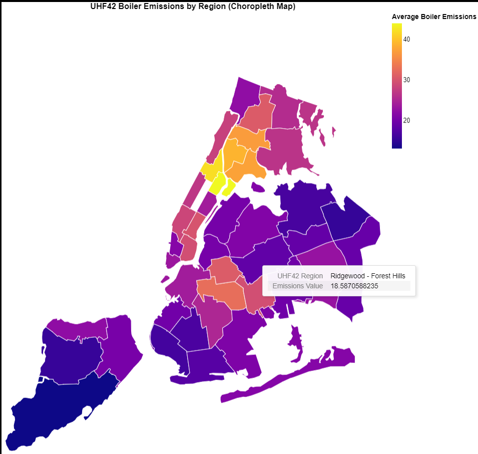
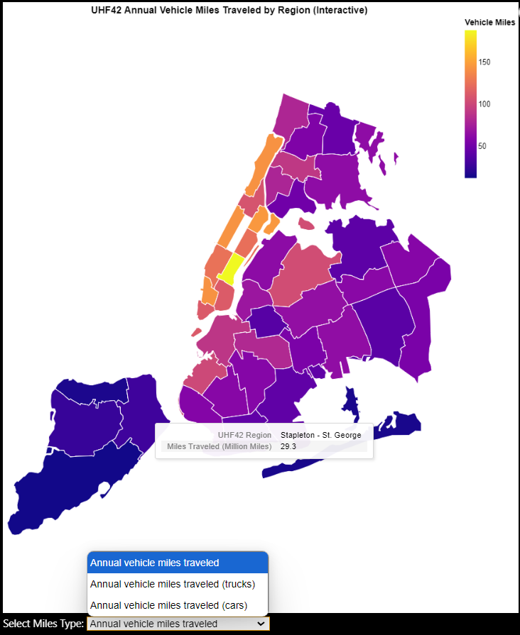
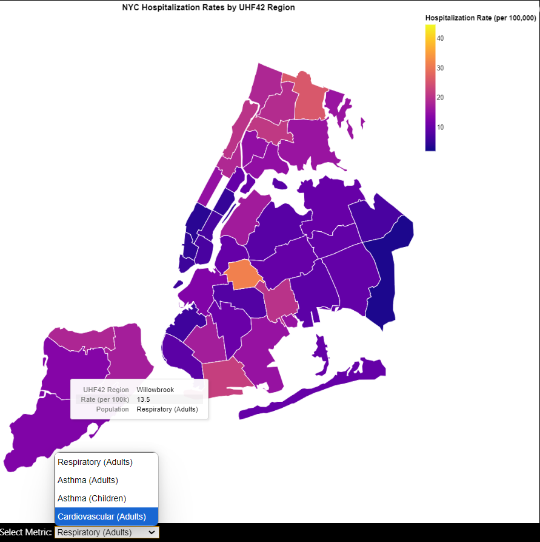
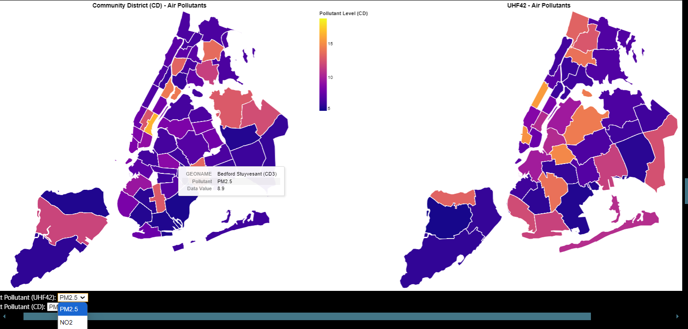
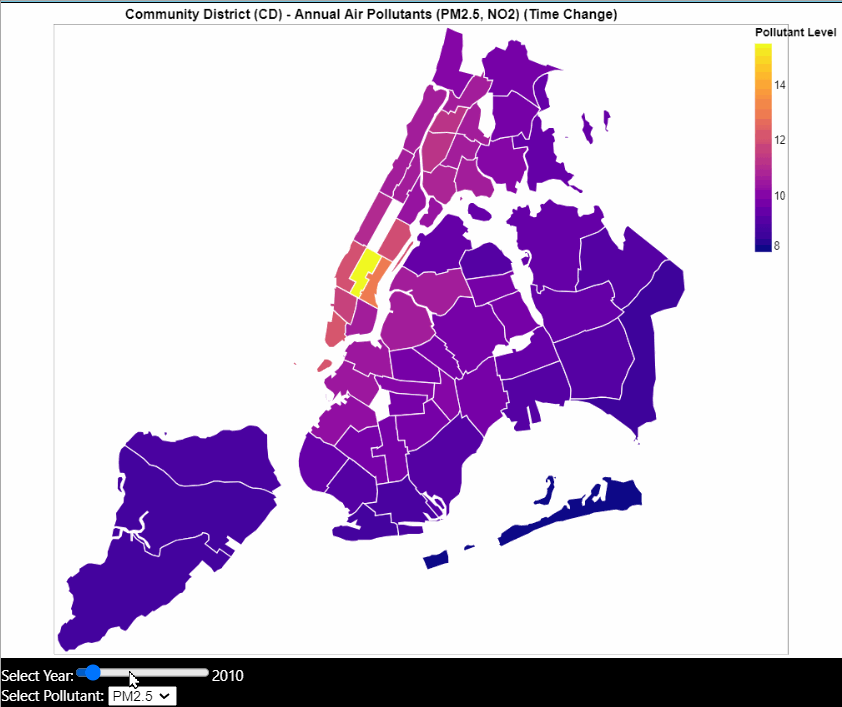
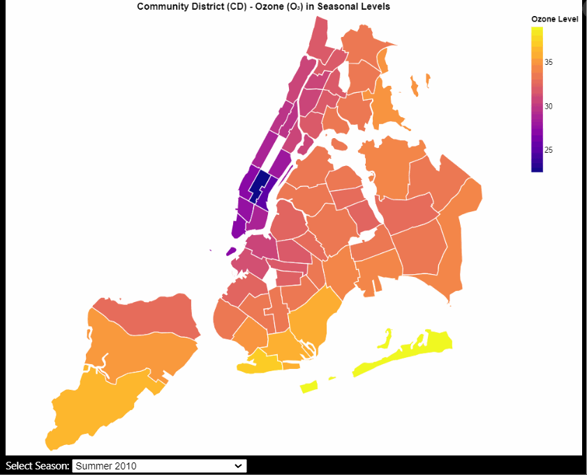

#### UHF42 Boiler Emissions Choropleth

This choropleth map shows average boiler emissions across UHF42 regions in NYC. The regions are filled based on emission intensity, with darker shades representing higher values. The geometry is reprojected to Web Mercator for consistent rendering, and tooltips reveal the region name and exact emission level on hover. This map provides a static but clear spatial baseline for observing emission concentration patterns across healthcare zones.

#### UHF42 Annual Vehicle Miles Traveled 

This interactive choropleth shows the total miles traveled by vehicles across NYC’s UHF42 regions. A dropdown allows switching between total vehicle miles, truck miles, and car miles. The map is color-encoded to represent mileage intensity, where warmer colors indicate regions with higher vehicle activity. Tooltips reveal the region name and exact values in millions of miles.

#### NYC Hospitalization Rates by UHF42 Region (Dropdown)

This choropleth map displays hospitalization rates per 100,000 residents across UHF42 regions in NYC. A dropdown menu allows users to switch between multiple health conditions, including respiratory and cardiovascular illnesses for both adults and children. The map uses a color gradient to represent hospitalization intensity, and tooltips provide region-level values and population group context on hover.

#### Community District (CD) and UHF42 Air Pollutants (Horizontal Comparison)

This side-by-side choropleth visualization compares pollutant concentrations (PM2.5,NO2 and O3) across two geographic levels: Community District (CD) and UHF42. Dropdown menus let users select the pollutant of interest for each map independently. This layout allows for easy spatial comparison across granularity levels, helping reveal whether patterns in fine-scale (CD) data align with broader regional patterns (UHF42). Tooltips show pollutant type, district/region name, and concentration values.

#### Community District-Level Air Pollutants (PM2.5, NO2, and Ozone)

**Description**:  
This visualization is a combination of two choropleth maps designed to show the spatial and temporal variation of air pollutants across NYC Community Districts (CD). It includes an interactive faceted map for PM2.5 and NO2 with a time slider, and a separate seasonal map for Ozone using a dropdown. This setup allows users to compare pollutant distributions over years and seasons while preserving temporal accuracy across different pollutant types.

**Attributes Being Visualized**

**Choropleth Map 1 – Annual Pollutants (PM2.5 and NO2)**  
- **Color Fill**: Districts are shaded based on the concentration of the selected pollutant; darker shades represent higher pollution.  
- **X-Axis (Facet)**: Pollutant name (PM2.5 or NO2).  
- **Slider**: Filters the map by year (2014–2022).  
- **Tooltip**: Shows Community District name, pollutant, and pollutant value.

**Choropleth Map 2 – Ozone (O3)**  
- **Color Fill**: Seasonal Ozone concentration, displayed using a consistent color scale.  
- **Dropdown**: Allows selection of the season (e.g., “Summer 2016”, “Fall 2017”).  
- **Tooltip**: Displays selected season, pollutant level, and district name.

**Interaction Mechanisms and Methods**  
**Mechanisms**:  
- Dropdown selection  
- Year slider  
- Hover tooltip  

**Methods**:  
- The PM2.5 and NO2 map uses **facet encoding** and a **time slider** for selecting specific years, allowing users to explore annual pollutant variation by district and pollutant type.  
- Ozone (O3) data was stored only with seasonal values (e.g., “Summer 2017”), not annual averages, which made it incompatible with the time slider used for PM2.5 and NO2. To address this, we built a **separate choropleth** for O3 using a dropdown filter for seasonal selection.  
- This design choice ensures clarity in temporal comparison and prevents misinterpretation due to incompatible time formats.

By separating these views but keeping a consistent encoding and layout, users can explore temporal-spatial patterns across pollutants in a clean and interpretable way.

**GIF Demonstrations**

**PM2.5 & NO2 with Time Slider:**  

**Ozone Seasonal Dropdown:**  

