# Air Quality Visual Analytics Project


---

## Task 3: Bar Chart Visualization

###  1. Data Loading Node
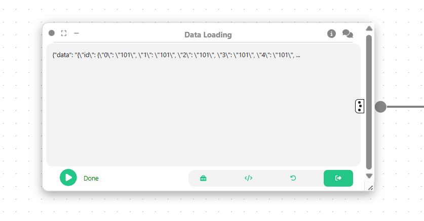
```python
import geopandas as gpd

# Load merged geospatial data
gdf = gpd.read_file("merged_all.geojson")

# Prepare for visualization
df = gdf.drop(columns="geometry")
df = df.dropna(subset=["Geo Place Name", "Pollutant", "Year", "Data Value"])
df["Year"] = df["Year"].astype(int)

# Set visualization metadata
df.metadata = {
    "name": "aq_bar_chart",
    "fields": {
        "Geo Place Name": "Nominal",
        "Pollutant": "Nominal", 
        "Year": "Ordinal",
        "Data Value": "Quantitative"
    }
}

return df
```

### 2. CD Region Bar Chart
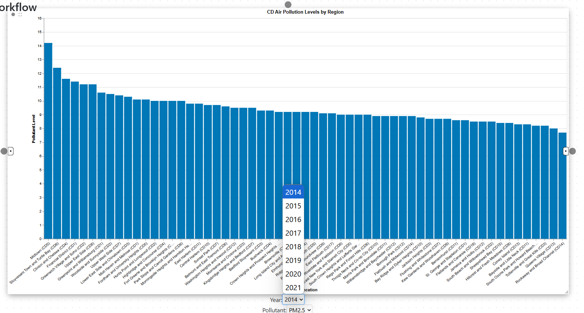
```json
{
  "$schema": "https://vega.github.io/schema/vega-lite/v5.json",
  "data": { "name": "aq_bar_chart_full" },
  "params": [
    {
      "name": "year",
      "bind": {
        "input": "select",
        "options": [2014, 2015, 2016, 2017, 2018, 2019, 2020, 2021],
        "name": "Year:"
      },
      "value": 2014
    },
    {
      "name": "pollutant",
      "bind": {
        "input": "select",
        "options": ["PM2.5", "NO2"],
        "name": "Pollutant:"
      },
      "value": "PM2.5"
    }
  ],
  "transform": [
    { "filter": "datum['Geo Type Name'] == 'CD'" },
    { "filter": "datum.Year == year" },
    { "filter": "datum.Pollutant == pollutant" }
  ],
  "mark": "bar",
  "encoding": {
    "x": {
      "field": "Geo Place Name",
      "type": "nominal",
      "sort": "-y",
      "title": "CD Location",
      "axis": { "labelAngle": -40 }
    },
    "y": {
      "field": "Data Value",
      "type": "quantitative",
      "title": "Pollutant Level"
    },
    "color": {
      "field": "Pollutant",
      "type": "nominal",
      "scale": {
        "domain": ["PM2.5", "NO2"],
        "range": ["#0077b6", "#f77f00"]
      },
      "legend": null
    },
    "tooltip": [
      { "field": "Geo Place Name", "type": "nominal" },
      { "field": "Pollutant", "type": "nominal" },
      { "field": "Year", "type": "quantitative" },
      { "field": "Data Value", "type": "quantitative" }
    ]
  },
  "width": 950,
  "height": 450,
  "title": "CD Air Pollution Levels by Region"
}

```

### 3. UHF42 Region Bar Chart
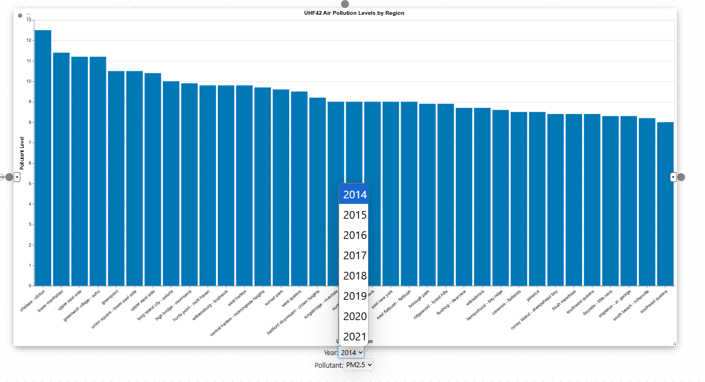
```json
{
  "$schema": "https://vega.github.io/schema/vega-lite/v5.json",
  "data": { "name": "aq_bar_chart_full" },
  "params": [
    {
      "name": "year",
      "bind": {
        "input": "select",
        "options": [2014, 2015, 2016, 2017, 2018, 2019, 2020, 2021],
        "name": "Year:"
      },
      "value": 2014
    },
    {
      "name": "pollutant",
      "bind": {
        "input": "select",
        "options": ["PM2.5", "NO2"],
        "name": "Pollutant:"
      },
      "value": "PM2.5"
    }
  ],
  "transform": [
    { "filter": "datum['Geo Type Name'] == 'UHF42'" },
    { "filter": "datum.Year == year" },
    { "filter": "datum.Pollutant == pollutant" }
  ],
  "mark": "bar",
  "encoding": {
    "x": {
      "field": "Geo Place Name",
      "type": "nominal",
      "sort": "-y",
      "title": "UHF42 Location",
      "axis": { "labelAngle": -40 }
    },
    "y": {
      "field": "Data Value",
      "type": "quantitative",
      "title": "Pollutant Level"
    },
    "color": {
      "field": "Pollutant",
      "type": "nominal",
      "scale": {
        "domain": ["PM2.5", "NO2"],
        "range": ["#0077b6", "#f77f00"]
      },
      "legend": null
    },
    "tooltip": [
      { "field": "Geo Place Name", "type": "nominal" },
      { "field": "Pollutant", "type": "nominal" },
      { "field": "Year", "type": "quantitative" },
      { "field": "Data Value", "type": "quantitative" }
    ]
  },
  "width": 950,
  "height": 450,
  "title": "UHF42 Air Pollution Levels by Region"
}

```

---

##  Task 4: Interactive Visualization

###  1. Data Loading Node
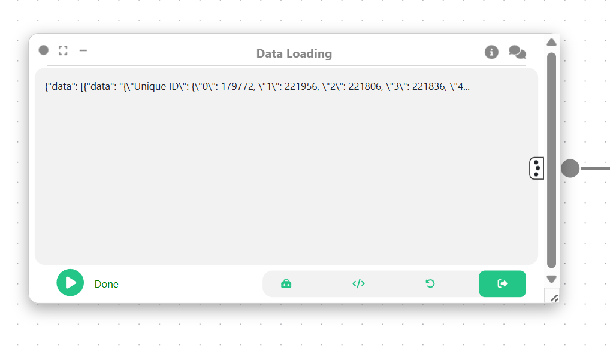
```python
import geopandas as gpd
import pandas as pd

air_quality = pd.read_csv("Airquality.csv")
uhf42 = gpd.read_file("UHF42.shp")

return air_quality, uhf42
```

###  2. Computation Node
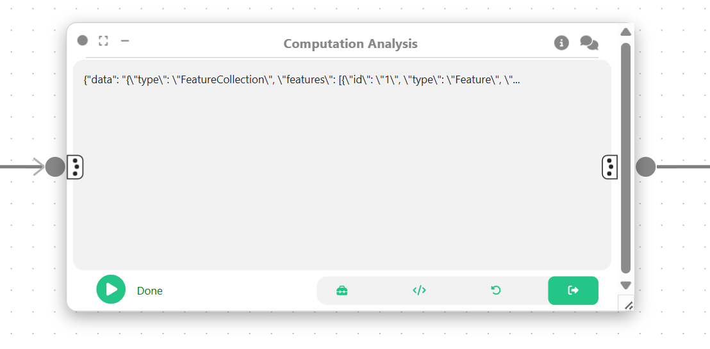
```python
air_quality, uhf42 = arg

air_quality = air_quality[air_quality['Geo Type Name'] == 'UHF42']
emissions = air_quality.groupby('Geo Join ID', as_index=False)['Data Value'].mean()
emissions.rename(columns={'Geo Join ID': 'id', 'Data Value': 'emissions_value'}, inplace=True)

emissions['id'] = emissions['id'].astype(float).astype(int).astype(str)
uhf42['id'] = uhf42['id'].astype(str).str.strip()

merged_gdf = uhf42.merge(emissions, on='id', how='left')
merged_gdf = merged_gdf.dropna(subset=['emissions_value'])

return merged_gdf
```

###  3. Transformation Node
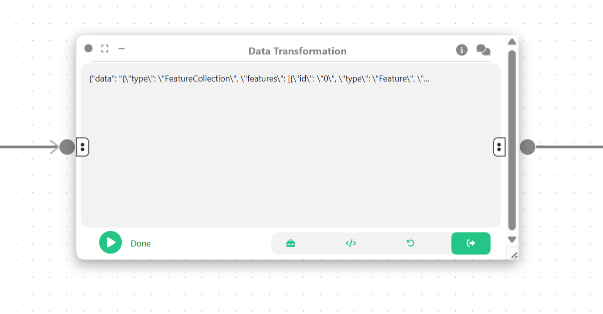
```python
import geopandas as gpd

merged_gdf = arg

merged_gdf = merged_gdf.loc[:, [merged_gdf.geometry.name, 'emissions_value', 'id']]
merged_gdf = merged_gdf.set_crs(2263)
merged_gdf = merged_gdf.to_crs(3857)

merged_gdf.metadata = {
    'name': 'boiler_emissions',
    'fields': {
        'id': 'Nominal',
        'emissions_value': 'Quantitative'
    }
}

return merged_gdf
```

###  4. Data Pool Node:
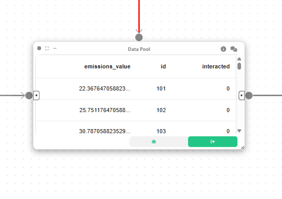
###  5. Interactive Plot with Vegalite Node:
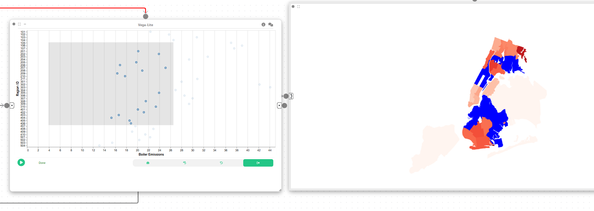
```json
{
  "$schema": "https://vega.github.io/schema/vega-lite/v5.json",
  "data": {
    "name": "boiler_emissions"
  },
  "params": [
    {
      "name": "regionSelect",
      "select": {
        "type": "point",
        "fields": ["id"]
      }
    },
    {
      "name": "brushSelect",
      "select": {
        "type": "interval",
        "encodings": ["x", "y"]
      }
    }
  ],
  "mark": "point",
  "encoding": {
    "x": {
      "field": "emissions_value",
      "type": "quantitative",
      "title": "Boiler Emissions"
    },
    "y": {
      "field": "id",
      "type": "nominal",
      "title": "Region ID"
    },
    "color": {
      "condition": {
        "param": "regionSelect",
        "value": "steelblue"
      },
      "value": "lightgray"
    },
    "opacity": {
      "condition": {
        "param": "brushSelect",
        "value": 1
      },
      "value": 0.2
    },
    "tooltip": [
      { "field": "id", "type": "nominal" },
      { "field": "emissions_value", "type": "quantitative" }
    ]
  }
}


```
---

##  Task 5: Spatial Analysis

###  1. Data Loading Node
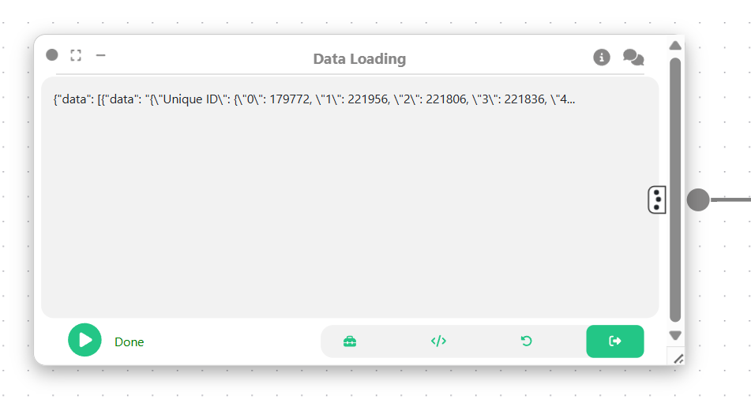
```python
import geopandas as gpd
import pandas as pd

air_quality = pd.read_csv("Airquality.csv")
uhf42 = gpd.read_file("UHF42.shp")

return air_quality, uhf42
```

###  2. Computation Node
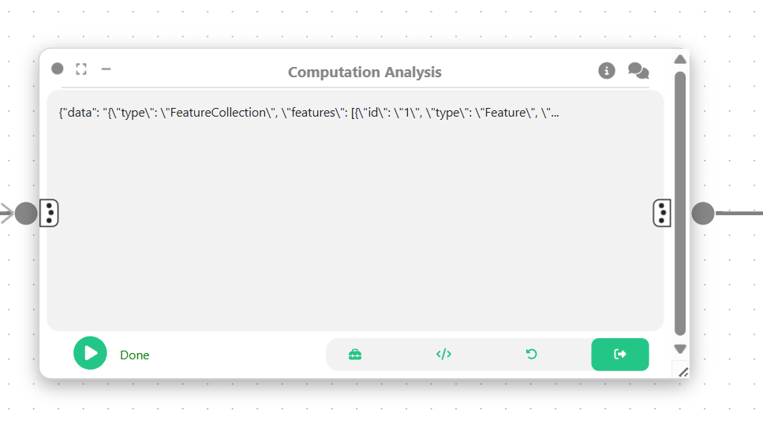
```python
air_quality, uhf42 = arg

air_quality = air_quality[air_quality['Geo Type Name'] == 'UHF42']
emissions = air_quality.groupby('Geo Join ID', as_index=False)['Data Value'].mean()

emissions.rename(columns={'Geo Join ID': 'id', 'Data Value': 'emissions_value'}, inplace=True)
emissions['id'] = emissions['id'].astype(float).astype(int).astype(str)
uhf42['id'] = uhf42['id'].astype(str).str.strip()

merged_gdf = uhf42.merge(emissions, on='id', how='left')
merged_gdf = merged_gdf.dropna(subset=['emissions_value'])

return merged_gdf
```

###  3. Transformation Node
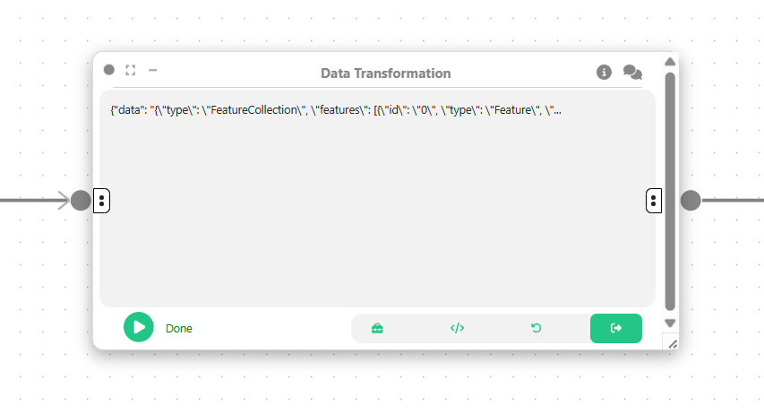
```python
import geopandas as gpd

merged_gdf = arg

merged_gdf = merged_gdf.loc[:, [merged_gdf.geometry.name, 'emissions_value', 'id']]
merged_gdf = merged_gdf.set_crs(2263)
merged_gdf = merged_gdf.to_crs(3857)

merged_gdf.metadata = {
    'name': 'boiler_emissions',
    'fields': {
        'id': 'Nominal",
        'emissions_value': 'Quantitative'
    },
    'bounds': merged_gdf.total_bounds.tolist()
}

return merged_gdf
```

---

# Task 6 

## Overview [D_W → V_W → U_Z → I]
This project implements a complete visual analytics pipeline from raw data to insights. The system combines spatial and tabular visualizations with interactive exploration features.

## Data Processing [D_W]

### Input Files [S]
- `Airquality.csv`: Air quality measurements (S₁)
- `UHF42.shp`: Geographic boundaries (S₂)

### Processing Steps
1. **Data Filtering [D_C]**
   - Extract UHF42 regions only
   - Group measurements by geographic area

2. **Data Cleaning [D_C]**
   - Standardize region ID formats
   - Handle missing values

3. **Data Integration [D_I]**
   - Merge air quality data with spatial boundaries
   - Validate region matching

4. **Spatial Transformation [D_T]**
   - Convert CRS (2263 → 3857) for web visualization

## Visualizations [V_W]

### Spatial Map [V_S]
- UTK Node implementation
- Choropleth of emission values
- Linked selection 

### Scatterplot [V_S]
- Vega-Lite implementation
- X: Emissions value (quantitative)
- Y: Region ID (nominal)
- Interactive tooltips

## Interaction Features [U_Z]

### Cross-Visual Linking [U_V]
- Selections between map and scatterplot
- Data Pool node used

### Interaction Methods

**Brush Selection [U_V → U_CV]** is used in scatterplot and spatial map
  
## Implementation
- **Data Processing**: GeoPandas/Pandas [D_W]
- **Spatial Viz**: UTK Node [V_W]  
- **Statistical Viz**: Vega-Lite [V_W]
- **Interaction**: Data Pool node [U_Z]

### Glossary
- [D_W] Data Preprocessing
- [D_C] Data Cleaning
- [D_I] Data Integration
- [D_T] Data Transformation  
- [V_W] Visualization
- [U_Z] User Interaction
- [I] Insight
- [S] Source Data
